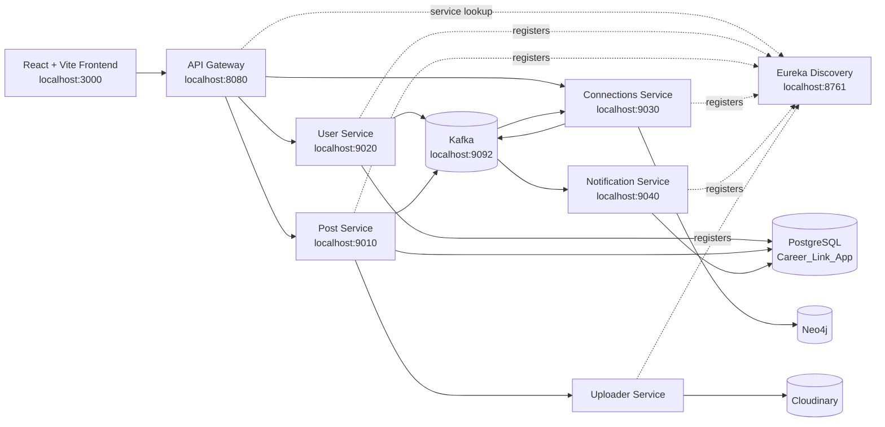

<div align="center">

# CareerLink

### A full-stack professional networking platform built with React, Spring Boot microservices, Kafka, Eureka, PostgreSQL, Neo4j, and Cloudinary.

<p>
  
  
  
  
  
</p>

<p>
  <a href="#overview">Overview</a> .
  <a href="#features">Features</a> .
  <a href="#architecture">Architecture</a> .
  <a href="#quick-start">Quick Start</a> .
  <a href="#services">Services</a> .
  <a href="#api-routes">API Routes</a>
</p>

</div>

---

## Overview

CareerLink is a LinkedIn-inspired career networking application with a modern glassmorphic frontend and a distributed backend. Users can authenticate, publish media posts, like posts, manage first-degree connections, accept or reject invitations, and receive event-driven notifications.

The project is split into independent services so each domain can evolve separately: users, posts, connections, uploads, notifications, discovery, and gateway routing.

## Features

<table>
  <tr>
    <td width="50%">
      <h3>Professional Feed</h3>
      <p>Create rich posts with media attachments, browse a timeline, like content, comment locally, and share post routes.</p>
    </td>
    <td width="50%">
      <h3>Network Graph</h3>
      <p>Send connection requests, accept or reject invitations, and model professional relationships through Neo4j.</p>
    </td>
  </tr>
  <tr>
    <td width="50%">
      <h3>JWT Authentication</h3>
      <p>Sign up and sign in through the user service, then route protected calls through the API Gateway authentication filter.</p>
    </td>
    <td width="50%">
      <h3>Event Driven Updates</h3>
      <p>Kafka events connect user, post, connection, and notification workflows without tightly coupling services.</p>
    </td>
  </tr>
  <tr>
    <td width="50%">
      <h3>Media Uploads</h3>
      <p>Posts can include multipart image uploads, delegated to the uploader service with Cloudinary support.</p>
    </td>
    <td width="50%">
      <h3>Service Discovery</h3>
      <p>Eureka keeps microservices discoverable and lets the gateway route by service name instead of hard-coded hosts.</p>
    </td>
  </tr>
</table>

## Tech Stack

| Layer | Technology |
| --- | --- |
| Frontend | React 19, TypeScript, Vite 6, Tailwind CSS 4, Motion, Lucide React |
| Gateway | Spring Cloud Gateway, JWT filter, Eureka client |
| Services | Spring Boot, Spring Web MVC, Spring Data JPA, Spring Data Neo4j, OpenFeign |
| Messaging | Apache Kafka, Spring Kafka |
| Databases | PostgreSQL, Neo4j |
| Storage | Cloudinary, optional Google Cloud Storage implementation |
| Discovery | Netflix Eureka |
| Runtime | Java 21, Node.js, npm, Maven Wrapper |

## Architecture



## Repository Structure

```text
Career-Link App/
|-- Frontend/                 React + Vite client
|-- api-gateway/              Spring Cloud Gateway and JWT request filtering
|-- Discovery-service/        Eureka service registry
|-- User-Services/            Authentication, users, JWT generation
|-- Post-Services/            Posts, likes, media post orchestration
|-- connections-service/      Network graph and connection requests
|-- notification-service/     Kafka-backed notification service
|-- Uploader-Service/         Cloudinary and storage upload endpoints
`-- README.md
```

## Services

| Service | Port | Context Path | Responsibility |
| --- | ---: | --- | --- |
| Frontend | 3000 | `/` | Web UI and client-side state |
| API Gateway | 8080 | `/` | Public API entrypoint and auth filtering |
| Discovery Service | 8761 | `/` | Eureka registry dashboard |
| User Service | 9020 | `/users` | Sign up, login, users, JWT |
| Post Service | 9010 | `/posts` | Create posts, fetch posts, like/unlike |
| Connections Service | 9030 | `/connections` | First-degree connections and invitations |
| Notification Service | 9040 | `/notifications` | Event-driven notifications |
| Uploader Service | dynamic/configured | `/file` | Multipart file upload |

## Quick Start

### 1. Prerequisites

Install these before running the project:

- Java 21
- Node.js 20 or newer
- npm
- PostgreSQL
- Neo4j
- Apache Kafka

### 2. Clone and enter the project

```powershell
git clone <your-repository-url>
cd "Career-Link App"
```

### 3. Prepare databases

Create the PostgreSQL database used by the services:

```sql
CREATE DATABASE "Career_Link_App";
```

Start Neo4j locally on:

```text
bolt://localhost:7687
```

Start Kafka locally on:

```text
localhost:9092
```

### 4. Configure secrets

The service config files currently contain local development values. For a real setup, move sensitive values into environment variables or local-only config files.

Recommended values to provide:

```text
JWT_SECRET_KEY=<strong-secret>
POSTGRES_URL=jdbc:postgresql://localhost:5432/Career_Link_App
POSTGRES_USERNAME=<your-postgres-user>
POSTGRES_PASSWORD=<your-postgres-password>
NEO4J_URI=bolt://localhost:7687
NEO4J_USERNAME=<your-neo4j-user>
NEO4J_PASSWORD=<your-neo4j-password>
CLOUDINARY_CLOUD_NAME=<your-cloud-name>
CLOUDINARY_API_KEY=<your-api-key>
CLOUDINARY_API_SECRET=<your-api-secret>
```

For the frontend, create `Frontend/.env.local`:

```env
VITE_API_BASE_URL=http://localhost:8080
```

### 5. Start backend services

Open separate terminals and run the services in this order:

```powershell
cd Discovery-service
.\mvnw spring-boot:run
```

```powershell
cd api-gateway
.\mvnw spring-boot:run
```

```powershell
cd User-Services
.\mvnw spring-boot:run
```

```powershell
cd connections-service
.\mvnw spring-boot:run
```

```powershell
cd Uploader-Service
.\mvnw spring-boot:run
```

```powershell
cd Post-Services
.\mvnw spring-boot:run
```

```powershell
cd notification-service
.\mvnw spring-boot:run
```

### 6. Start the frontend

```powershell
cd Frontend
npm install
npm run dev
```

Open:

```text
http://localhost:3000
```

## API Routes

Requests should normally go through the API Gateway at `http://localhost:8080`.

| Domain | Method | Gateway Route | Description |
| --- | --- | --- | --- |
| Auth | POST | `/api/v1/users/auth/signup` | Create a new user |
| Auth | POST | `/api/v1/users/auth/login` | Login and receive a JWT |
| Posts | POST | `/api/v1/posts/core` | Create a multipart post |
| Posts | GET | `/api/v1/posts/core/{postId}` | Fetch a post by id |
| Posts | GET | `/api/v1/posts/core/users/{userId}/allPosts` | Fetch posts for a user |
| Likes | POST | `/api/v1/posts/likes/{postId}` | Like a post |
| Likes | DELETE | `/api/v1/posts/likes/{postId}` | Unlike a post |
| Connections | GET | `/api/v1/connections/core/{userId}/first-degree` | Get first-degree connections |
| Connections | POST | `/api/v1/connections/core/request/{userId}` | Send a connection request |
| Connections | POST | `/api/v1/connections/core/accept/{userId}` | Accept a connection request |
| Connections | POST | `/api/v1/connections/core/reject/{userId}` | Reject a connection request |

Protected routes require:

```http
Authorization: Bearer <jwt-token>
```

## Development Commands

### Frontend

```powershell
cd Frontend
npm run dev
npm run build
npm run lint
```

### Backend tests

Run from any Spring service folder:

```powershell
.\mvnw test
```

## UI Highlights

- Split-screen animated authentication experience
- Glassmorphic dashboard surfaces
- Feed, network, profile, and notifications tabs
- Local fallback state with backend synchronization when authenticated
- Lucide icons and responsive React components

## Notes for Contributors

- Keep service-specific logic inside its own microservice.
- Route public client calls through `api-gateway` where possible.
- Keep secrets out of committed config files for production use.
- Prefer environment variables or profile-specific config for local credentials.
- Start Eureka before services that register with it.

## Roadmap Ideas

- Docker Compose for PostgreSQL, Neo4j, Kafka, and all services
- Centralized config service
- Refresh-token flow
- Real-time notifications over WebSocket or Server-Sent Events
- Comment persistence in the post service
- CI pipeline for frontend build and Maven tests

---

<div align="center">

Built as a modern career-networking system with a polished frontend and service-oriented backend.

**CareerLink** - connect people, posts, and opportunities.

</div>
